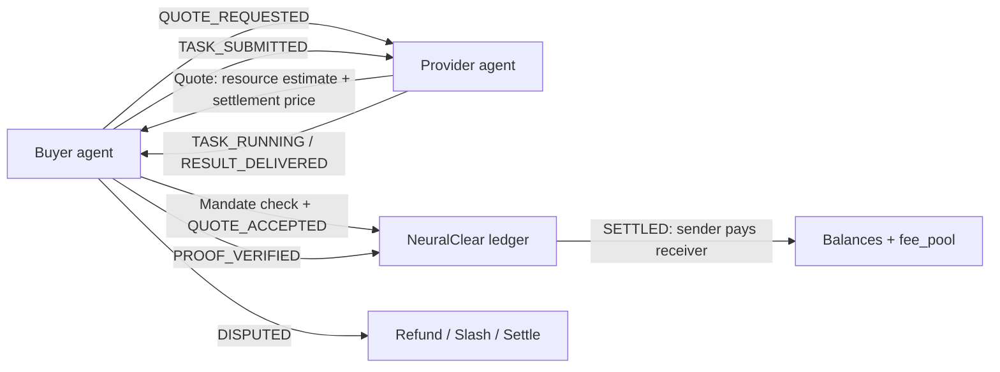

# NeuralClear

NeuralClear is an open clearing and trust protocol prototype for AI agent-to-agent service transactions.

It standardizes how agents quote, authorize, execute, verify, settle, and dispute service transactions. NeuralClear does not issue money, custody funds, or replace payment rails; it defines the transaction semantics around agent services.

## Why NeuralClear

Agent ecosystems need more than message passing. A buyer agent needs to know:

- which provider can perform a capability
- how the task is priced
- whether it is authorized to spend on behalf of an owner
- what proof level comes with the result
- how balances move after settlement
- how disputes, refunds, slashing, and expiration are represented

NeuralClear is a small Python protocol prototype for those clearing semantics. Actual payment can be handled by adapters such as internal credits, Stripe, stablecoins, x402-style HTTP payment, or other rails.

## Core Flow



`Transaction.amount > 0` always means `sender` pays `receiver`.

## Quick Run

```bash
python3 examples/demo.py
python3 examples/marketplace/demo_marketplace.py
python3 -m unittest discover
```

The demo prints a `TaskResult` and ledger snapshot. Tests cover payment direction, insufficient credit, zero-sum clearing, registration, discovery, mandate limits, quote expiration, and dispute state transitions.

## HTTP Draft

The draft HTTP surface is in [OPENAPI.yaml](OPENAPI.yaml). A provider can expose a manifest at:

```text
/.well-known/neuralclear/agent.json
```

See [examples/well-known/agent.json](examples/well-known/agent.json) for a concrete manifest.

## Local Sandbox

Install the optional HTTP dependencies:

```bash
python3 -m pip install -e ".[http]"
```

Run the reference server:

```bash
NEURALCLEAR_API_KEY=dev_neuralclear_key \
NEURALCLEAR_DB=./neuralclear-sandbox.db \
uvicorn server.app:app --port 8000
```

Use the CLI from another terminal:

```bash
export NEURALCLEAR_BASE_URL=http://127.0.0.1:8000
export NEURALCLEAR_API_KEY=dev_neuralclear_key

python3 -m client.cli agents list
python3 -m client.cli agents search summarize.pdf
python3 -m client.cli agent register examples/well-known/agent.json
python3 -m client.cli quote request agent.pdf_summarizer summarize.pdf
python3 -m client.cli task submit quote_xxx --text "Summarize this PDF text."
python3 -m client.cli receipts list
python3 -m client.cli balances
```

Protected write endpoints require:

```text
X-NeuralClear-API-Key: dev_neuralclear_key
```

The sandbox dashboard is available at:

```text
http://127.0.0.1:8000/dashboard/agents
http://127.0.0.1:8000/dashboard/transactions
http://127.0.0.1:8000/dashboard/receipts
http://127.0.0.1:8000/dashboard/disputes
http://127.0.0.1:8000/dashboard/balances
```

For local persistence across restarts, set:

```bash
NEURALCLEAR_DB=./neuralclear-sandbox.db uvicorn server.app:app --port 8000
```

Docker Compose is also supported:

```bash
cp .env.example .env
docker compose up --build
```

Developer docs are in [docs/quickstart.md](docs/quickstart.md), [docs/api-reference.md](docs/api-reference.md), and [docs/deployment.md](docs/deployment.md).

## Protocol Objects

`ResourceUnit` measures resources such as tokens, GPU seconds, bandwidth, or storage.

```json
{ "amount": 8000, "unit": "tokens" }
```

`SettlementCredit` is the value used for clearing.

```json
{ "amount": 25, "currency": "CC" }
```

`AgentInfo` advertises identity, endpoint, public key, capabilities, pricing, and reputation. See [examples/agent_manifest.json](examples/agent_manifest.json) and [schemas/agent_manifest.schema.json](schemas/agent_manifest.schema.json).

`SpendingMandate` delegates spending authority from an owner to an agent, bounded by capability, per-task amount, daily amount, expiration, and human-approval threshold. See [examples/spending_mandate.json](examples/spending_mandate.json).

`Quote` binds a provider, capability, resource estimate, settlement price, and expiration. See [examples/quote.json](examples/quote.json).

`Transaction` records sender, receiver, settlement amount, optional fee, capability, quote, and lifecycle state. See [examples/transaction.json](examples/transaction.json).

`TaskResult` returns output, resource usage, settlement amount, and a proof object. See [examples/task_result.json](examples/task_result.json).

## Proof Levels

The current implementation includes `MockProof` for local development only. It is not a real TEE proof.

Supported proof level names:

- `NONE`
- `SIGNED_RESULT`
- `REPRODUCIBLE`
- `TEE_ATTESTATION`
- `ZK_PROOF`

## Relationship To A2A, MCP, AP2, And x402

- A2A lets agents communicate and coordinate. NeuralClear adds quote, mandate, settlement, proof, receipt, dispute, and reputation semantics around commercial service transactions.
- MCP connects models and agents to tools, data, and workflows. NeuralClear can clear commercial usage around MCP-style tool calls.
- AP2-style authorization motivates `SpendingMandate`: an owner can grant bounded spending authority without giving an agent unlimited payment power.
- x402-style payment-gated HTTP can execute machine-native payment. NeuralClear can decide when payment is due and produce the receipt, proof, and dispute record around it.

NeuralClear is intended to compose with these protocols, not replace them.

## Current Status

Current stage: V0.3 sandbox prototype complete.

Next milestone: V0.4 hosted developer sandbox.

Prototype only. Not production ready.

This repository does not implement real custody, real payment execution, real TEE attestation, real ZK verification, identity recovery, compliance, finality guarantees, or adversarial dispute resolution. Treat it as a protocol sketch with executable tests.

Suggested GitHub About text:

```text
Prototype clearing, authorization, proof, and dispute layer for AI agent-to-agent service transactions.
```
