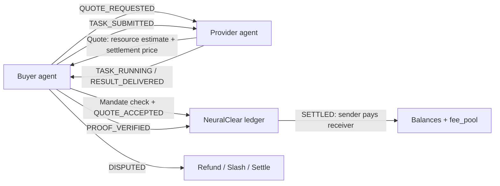

# NeuralClear

NeuralClear is a prototype clearing protocol for AI agent-to-agent service transactions.

It explores how autonomous agents can quote work, receive delegated spending authority, deliver results, verify proofs, and settle credits without pretending that a demo ledger is production finance.

## Why NeuralClear

Agent ecosystems need more than message passing. A buyer agent needs to know:

- which provider can perform a capability
- how the task is priced
- whether it is authorized to spend on behalf of an owner
- what proof level comes with the result
- how balances move after settlement
- how disputes, refunds, slashing, and expiration are represented

NeuralClear is a small Python protocol prototype for those clearing semantics.

## Core Flow



`Transaction.amount > 0` always means `sender` pays `receiver`.

## Quick Run

```bash
python3 examples/demo.py
python3 -m unittest discover
```

The demo prints a `TaskResult` and ledger snapshot. Tests cover payment direction, insufficient credit, zero-sum clearing, registration, discovery, mandate limits, quote expiration, and dispute state transitions.

## Protocol Objects

`ResourceUnit` measures resources such as tokens, GPU seconds, bandwidth, or storage.

```json
{ "amount": 8000, "unit": "tokens" }
```

`SettlementCredit` is the value used for clearing.

```json
{ "amount": 25, "currency": "CC" }
```

`AgentInfo` advertises identity, endpoint, public key, capabilities, pricing, and reputation. See [examples/agent_manifest.json](examples/agent_manifest.json) and [schemas/agent_manifest.schema.json](schemas/agent_manifest.schema.json).

`SpendingMandate` delegates spending authority from an owner to an agent, bounded by capability, per-task amount, daily amount, expiration, and human-approval threshold. See [examples/spending_mandate.json](examples/spending_mandate.json).

`Quote` binds a provider, capability, resource estimate, settlement price, and expiration. See [examples/quote.json](examples/quote.json).

`Transaction` records sender, receiver, settlement amount, optional fee, capability, quote, and lifecycle state. See [examples/transaction.json](examples/transaction.json).

`TaskResult` returns output, resource usage, settlement amount, and a proof object. See [examples/task_result.json](examples/task_result.json).

## Proof Levels

The current implementation includes `MockProof` for local development only. It is not a real TEE proof.

Supported proof level names:

- `NONE`
- `SIGNED_RESULT`
- `REPRODUCIBLE`
- `TEE_ATTESTATION`
- `ZK_PROOF`

## Relationship To A2A, MCP, AP2, And x402

- A2A is a useful transport and interaction pattern for agent-to-agent task exchange. NeuralClear focuses on quote, authorization, settlement, and dispute semantics around those exchanges.
- MCP exposes tools and resources to agents. NeuralClear can price and settle calls made through MCP-style capabilities.
- AP2-style payment authorization motivates the `SpendingMandate` model: an owner can delegate bounded purchasing power to an agent without giving unlimited authority.
- x402-style payment-gated HTTP can be one settlement or access layer underneath a NeuralClear quote. NeuralClear keeps a broader lifecycle for task results, proofs, disputes, and clearing.

## Current Status

Prototype only. Not production ready.

This repository does not implement real custody, real TEE attestation, real ZK verification, identity recovery, compliance, finality guarantees, or adversarial dispute resolution. Treat it as a protocol sketch with executable tests.
