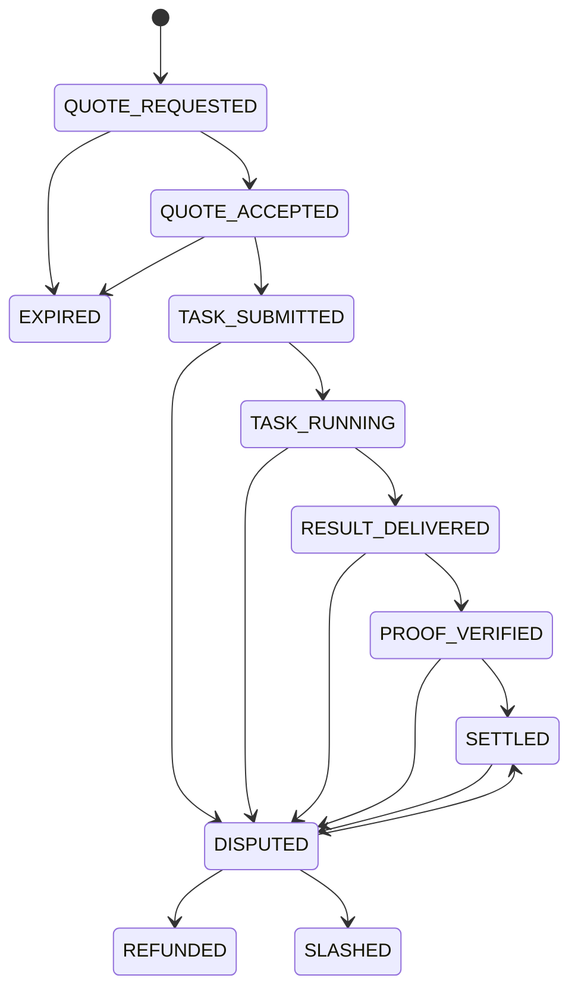

# NeuralClear Protocol Specification

Status: prototype draft.

## 1. Transaction Direction

`Transaction.amount > 0` means `sender` pays `receiver`.

The sender balance decreases by `amount + fee`. The receiver balance increases by `amount`. Fees, when present, increase `fee_pool`. No negative payment amounts are used to express direction.

## 2. Resource Metering And Settlement

NeuralClear separates metering from clearing:

- `ResourceUnit`: measures consumed or estimated resources, such as `tokens`, `gpu_seconds`, `bandwidth_mb`, `storage_mb`, or `request`.
- `SettlementCredit`: the clearing denomination used to debit and credit ledger accounts.

Example:

```json
{
  "resource_estimate": { "amount": 8000, "unit": "tokens" },
  "settlement_price": { "amount": 25, "currency": "CC" }
}
```

## 3. Agent Manifest

An agent manifest advertises:

- `agent_id`
- `name`
- `endpoint`
- `public_key`
- `capabilities`
- `pricing`
- `reputation`

The schema is defined in `schemas/agent_manifest.schema.json`. A full example is in `examples/agent_manifest.json`.

## 4. Spending Mandate

`SpendingMandate` solves the problem of an agent being authorized to spend money on behalf of an owner without receiving unlimited authority.

Fields:

- `owner`: the human, organization, wallet, or account granting authority
- `agent`: the delegated agent identity
- `allowed_capabilities`: capabilities the delegate may buy
- `max_per_task`: maximum settlement credit for one task
- `max_daily`: daily aggregate limit
- `valid_until`: expiration timestamp
- `requires_human_approval_above`: threshold where manual approval is required
- `signature`: signature over the mandate body

Minimal example:

```json
{
  "owner": "user.alice",
  "agent": "agent.alice.delegate",
  "allowed_capabilities": ["summarize.paper"],
  "max_per_task": { "amount": 30, "currency": "CC" },
  "max_daily": { "amount": 100, "currency": "CC" },
  "valid_until": 1790000000,
  "requires_human_approval_above": { "amount": 50, "currency": "CC" },
  "signature": "ed25519:demo-signature"
}
```

The prototype checks expiration, capability, currency, and per-task limit. Daily aggregation and real signature verification are intentionally left as future work.

## 5. Lifecycle State Machine

Transaction states:

- `QUOTE_REQUESTED`
- `QUOTE_ACCEPTED`
- `TASK_SUBMITTED`
- `TASK_RUNNING`
- `RESULT_DELIVERED`
- `PROOF_VERIFIED`
- `SETTLED`
- `DISPUTED`
- `REFUNDED`
- `SLASHED`
- `EXPIRED`

Allowed transitions:



## 6. Proof Model

`MockProof` is a local development placeholder. It must not be represented as a real TEE proof.

Proof levels:

- `NONE`
- `SIGNED_RESULT`
- `REPRODUCIBLE`
- `TEE_ATTESTATION`
- `ZK_PROOF`

Future implementations may attach provider signatures, reproducibility metadata, TEE attestation documents, or ZK proof artifacts.

## 7. Strict Zero-Sum Clearing

`verify_zero_sum()` compares total balances plus `fee_pool` before and after settlement. There is no tolerance band.

For a transaction:

```text
sender_delta = -(amount + fee)
receiver_delta = amount
fee_pool_delta = fee
sender_delta + receiver_delta + fee_pool_delta = 0
```

Any fee must be explicit and must enter `fee_pool`.

## 8. Error Conditions

The prototype raises `ProtocolError` for invalid settlement direction, insufficient credit, expired quotes, unsupported capabilities, invalid mandates, and invalid state transitions.
