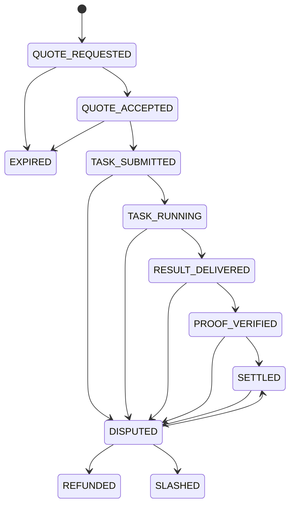

# NeuralClear Protocol Specification

Status: prototype draft.

## 0. Scope

NeuralClear defines clearing and trust semantics for AI agent service transactions. It does not define a new currency, custody user funds, or require a specific payment rail.

The protocol coordinates:

- agent identity and capability publication
- quotes and price commitments
- delegated spending mandates
- task submission and result delivery
- proof metadata
- settlement receipts
- disputes, refunds, and slashing states
- reputation records

Payment execution can happen through internal credits, card processors, bank rails, stablecoins, x402-style HTTP payments, or other adapters.

## 1. Roles

- `Owner`: the person, organization, wallet, or account that grants spending authority.
- `Buyer Agent`: the agent that requests quotes and submits tasks on behalf of an owner.
- `Provider Agent`: the agent that advertises capabilities, returns quotes, executes tasks, and delivers results.
- `Registry`: a directory or discovery service for agent manifests, capabilities, pricing, and reputation.
- `Ledger`: the clearing record that tracks settlement credits, transaction states, receipts, fees, and disputes.

NeuralClear does not require these roles to be operated by one party. A deployment can use a local in-memory ledger, a hosted clearing service, or an adapter to external payment infrastructure.

## 2. Protocol Objects

### AgentManifest

Published by a provider to describe identity, endpoint, public key, capabilities, pricing, and reputation. Providers should expose the manifest at:

```text
GET /.well-known/neuralclear/agent.json
```

### Capability

A named service the provider can perform, such as `summarize.pdf`, `search.web`, `review.code`, or `translate.text`. Capabilities should include resource and settlement pricing.

### Quote

A provider commitment that binds:

- provider
- capability
- resource estimate
- settlement price
- expiration time

Expired quotes must not be accepted.

### SpendingMandate

A bounded authorization from an owner to an agent. It controls allowed capabilities, per-task spend, daily spend, expiration, human approval thresholds, and signature metadata.

### TaskRequest

The buyer's request to execute a task after accepting a quote. It includes the quote id, capability, payload, and mandate.

### TaskResult

The provider's response, including output, resource usage, settlement amount, and proof metadata.

### Proof

Evidence metadata associated with a result. The prototype only includes `MockProof`; it is not a real attestation, signature proof, reproducibility proof, or ZK proof.

### Transaction

The clearing record for a service transaction. It tracks sender, receiver, amount, fee, quote id, capability, authorized agent, settlement time, and lifecycle state.

### SettlementReceipt

A durable record that a transaction was settled, disputed, refunded, or slashed. The current Python prototype records transactions in memory; the HTTP draft reserves a receipt object for hosted or persistent implementations.

### Dispute

A record opened when a buyer, provider, or clearing service challenges a transaction. Disputes can resolve to settlement, refund, or slashing.

## 3. Transaction Direction

`Transaction.amount > 0` means `sender` pays `receiver`.

The sender balance decreases by `amount + fee`. The receiver balance increases by `amount`. Fees, when present, increase `fee_pool`. No negative payment amounts are used to express direction.

## 4. Resource Metering And Settlement

NeuralClear separates metering from clearing:

- `ResourceUnit`: measures consumed or estimated resources, such as `tokens`, `gpu_seconds`, `bandwidth_mb`, `storage_mb`, or `request`.
- `SettlementCredit`: the clearing denomination used to debit and credit ledger accounts.

Example:

```json
{
  "resource_estimate": { "amount": 8000, "unit": "tokens" },
  "settlement_price": { "amount": 25, "currency": "CC" }
}
```

## 5. Agent Manifest

An agent manifest advertises:

- `agent_id`
- `name`
- `endpoint`
- `public_key`
- `capabilities`
- `pricing`
- `reputation`

The schema is defined in `schemas/agent_manifest.schema.json`. A full example is in `examples/agent_manifest.json`.

## 6. Mandate Validation

`SpendingMandate` solves the problem of an agent being authorized to spend money on behalf of an owner without receiving unlimited authority.

Fields:

- `owner`: the human, organization, wallet, or account granting authority
- `agent`: the delegated agent identity
- `allowed_capabilities`: capabilities the delegate may buy
- `max_per_task`: maximum settlement credit for one task
- `max_daily`: daily aggregate limit
- `valid_until`: expiration timestamp
- `requires_human_approval_above`: threshold where manual approval is required
- `signature`: signature over the mandate body

Minimal example:

```json
{
  "owner": "user.alice",
  "agent": "agent.alice.delegate",
  "allowed_capabilities": ["summarize.paper"],
  "max_per_task": { "amount": 30, "currency": "CC" },
  "max_daily": { "amount": 100, "currency": "CC" },
  "valid_until": 1790000000,
  "requires_human_approval_above": { "amount": 50, "currency": "CC" },
  "signature": "ed25519:demo-signature"
}
```

The prototype checks expiration, capability, currency, per-task limit, and in-memory daily spend. Real signature verification is intentionally left as future work.

Validation requirements:

- mandate must not be expired
- requested capability must be allowed
- settlement currency must match the mandate currency
- quote amount must be less than or equal to `max_per_task`
- current daily spend plus quote amount must be less than or equal to `max_daily`
- production implementations must verify the mandate signature before relying on it

## 7. Lifecycle State Machine

Transaction states:

- `QUOTE_REQUESTED`
- `QUOTE_ACCEPTED`
- `TASK_SUBMITTED`
- `TASK_RUNNING`
- `RESULT_DELIVERED`
- `PROOF_VERIFIED`
- `SETTLED`
- `DISPUTED`
- `REFUNDED`
- `SLASHED`
- `EXPIRED`

Allowed transitions:



## 8. Proof Model

`MockProof` is a local development placeholder. It must not be represented as a real TEE proof.

Proof levels:

- `NONE`
- `SIGNED_RESULT`
- `REPRODUCIBLE`
- `TEE_ATTESTATION`
- `ZK_PROOF`

Future implementations may attach provider signatures, reproducibility metadata, TEE attestation documents, or ZK proof artifacts.

## 9. Dispute Flow

A settled transaction cannot be refunded directly in this prototype. It must first enter `DISPUTED`, then resolve to one of:

- `REFUNDED`: buyer is made whole according to the deployment's refund policy
- `SLASHED`: provider is penalized according to the deployment's slashing policy
- `SETTLED`: the dispute is rejected or resolved in favor of settlement

The prototype models dispute states only; it does not implement arbitration, escrow, evidence review, or legal claims.

## 10. Strict Zero-Sum Clearing

`verify_zero_sum()` compares total balances plus `fee_pool` before and after settlement. There is no tolerance band.

For a transaction:

```text
sender_delta = -(amount + fee)
receiver_delta = amount
fee_pool_delta = fee
sender_delta + receiver_delta + fee_pool_delta = 0
```

Any fee must be explicit and must enter `fee_pool`.

## 11. Error Codes

The Python prototype raises `ProtocolError` for protocol failures. HTTP implementations should map failures to stable error codes:

- `QUOTE_EXPIRED`
- `INSUFFICIENT_CREDIT`
- `CAPABILITY_NOT_ALLOWED`
- `MANDATE_EXPIRED`
- `MANDATE_LIMIT_EXCEEDED`
- `MANDATE_CURRENCY_MISMATCH`
- `PROOF_VERIFICATION_FAILED`
- `INVALID_STATE_TRANSITION`
- `LEDGER_INVARIANT_FAILED`
- `UNKNOWN_AGENT`

## 12. HTTP Discovery Draft

Providers should expose an agent manifest at:

```text
GET /.well-known/neuralclear/agent.json
```

The draft HTTP API is described in `OPENAPI.yaml` and includes quote, task, settlement, and dispute endpoints.

## 13. Security Notes

Prototype limitations:

- no real custody
- no real payment execution
- no real signature verification
- no replay protection
- no production dispute resolution
- no real TEE attestation
- no real ZK proof verification
- no compliance, KYC, AML, sanctions, or tax controls

Production implementations must treat manifests, quotes, mandates, task payloads, proofs, receipts, and dispute evidence as security-sensitive records.

## 14. Non-Goals

NeuralClear is not:

- a bank
- a wallet
- a token issuer
- a money transmitter
- a replacement for MCP
- a replacement for A2A
- a replacement for AP2
- a replacement for x402
- a production financial system
